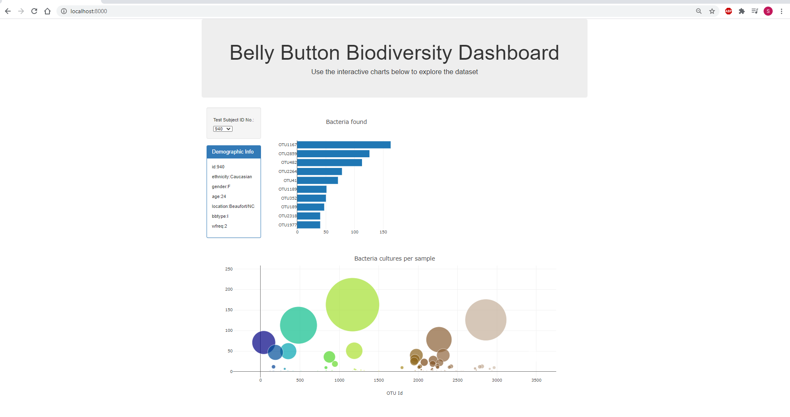
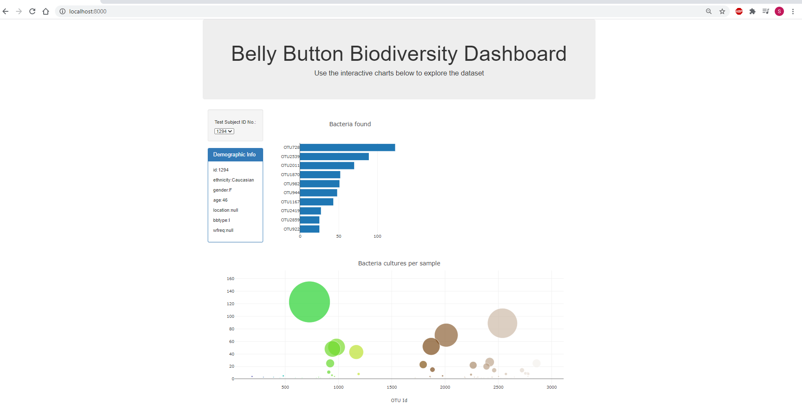

<!---Project Logo -->
 

  <h3 align="center">Belly Button Biodiversity</h3>
   

<!-- TABLE OF CONTENTS -->
## Table of Contents

* [About the Project](#about-the-project)
  * [Built With](#built-with)
* [Usage](#usage)
* [Getting Started](#getting-started)
  * [Heroku](#heroku)
  * [Local](#local)
* [Contributors](#contributors)
* [Acknowledgements](#acknowledgements)

<!-- ABOUT THE PROJECT -->
## About The Project 

In this project, I have built an interactive dashboard to explore the Belly Button Biodiversity dataset, which catalogs the microbes that colonize human navels.

The dataset reveals that a small handful of microbial species (also called operational taxonomic units, or OTUs, in the study) were present in more than 70% of people, while the rest were relatively rare.

I took following steps to create the dashboard.

1. Use the D3 library to read in `samples.json`.

2. Create a horizontal bar chart with a dropdown menu to display the top 10 OTUs found in that individual.

* Use `sample_values` as the values for the bar chart.

* Use `otu_ids` as the labels for the bar chart.

* Use `otu_labels` as the hovertext for the chart.

  
3. Create a bubble chart that displays each sample.

* Use `otu_ids` for the x values.

* Use `sample_values` for the y values.

* Use `sample_values` for the marker size.

* Use `otu_ids` for the marker colors.

* Use `otu_labels` for the text values.

4. Display the sample metadata, i.e., an individual's demographic information.

5. Display each key-value pair from the metadata JSON object on the page.

6. Update all of the plots any time that a new sample is selected.

Here are a couple of screenshots of the dashboard for 2 different subject ids, 940 and 1294 respectively.

### Built With
* [Javascript](https://developer.mozilla.org/en-US/docs/Web/javascript)
  * [Plotly](https://plotly.com/javascript/)

### Usage
To load the dashboard, use the following steps.

1. Run a simple HTTP server with python. Open gitbash and type python -m http.server
2. Open your web broswer and go to http://localhost:8000/. 

## Deployment

The apps is deployed to a free static page hosting service at Github pages. Please click [here](https://susovd.github.io/plotly-challenge/files/index.html). 

**Additional reference materials:**

_Best-README-Template_ Retrieved from: [https://github.com/othneildrew/Best-README-Template](https://github.com/othneildrew/Best-README-Template)

Refer to the [Plotly.js documentation](https://plot.ly/javascript/) when building the plots.

### About the Data

Hulcr, J. et al.(2012) _A Jungle in There: Bacteria in Belly Buttons are Highly Diverse, but Predictable_. Retrieved from: [http://robdunnlab.com/projects/belly-button-biodiversity/results-and-data/](http://robdunnlab.com/projects/belly-button-biodiversity/results-and-data/)

